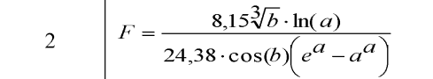
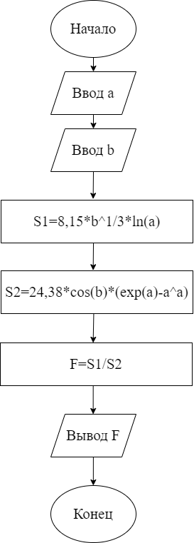
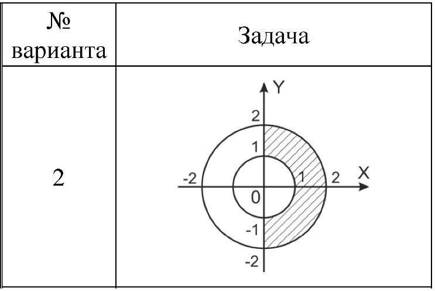
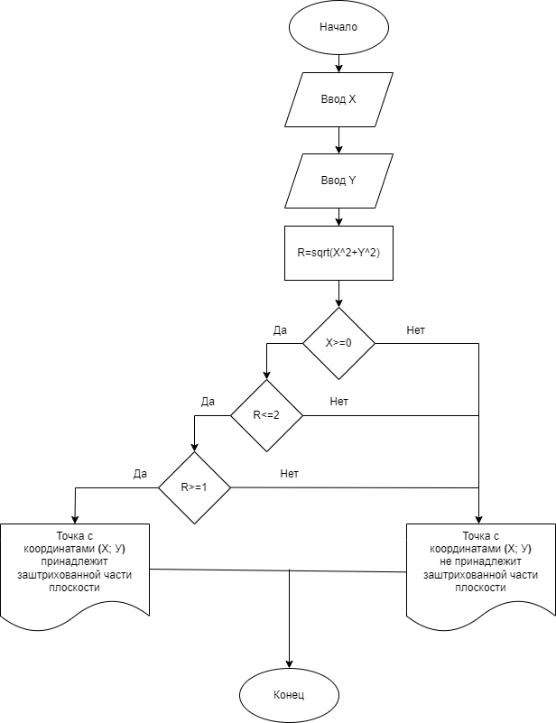
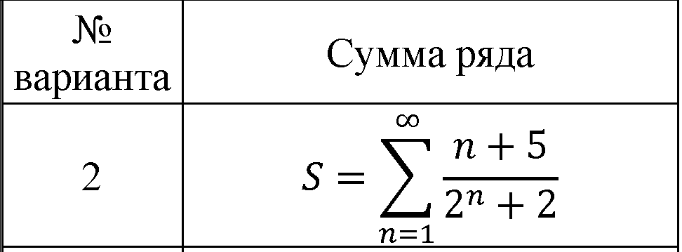
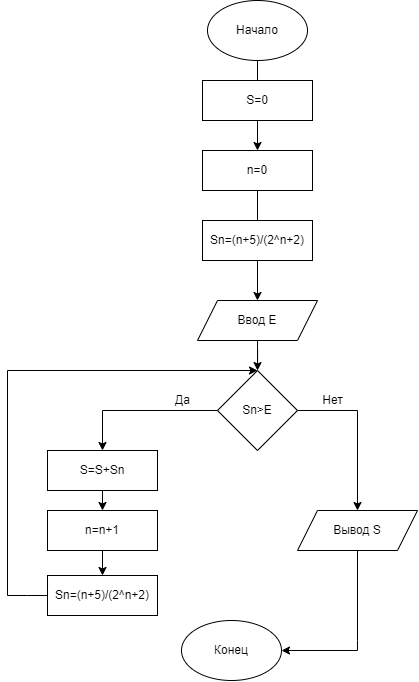

**ЛАБОРАТОРНАЯ РАБОТА № 1 АЛГОРИТМИЗАЦИЯ И ПРОГРАММИРОВАНИЕ**

**Цель работы:** усвоить понятие алгоритма как фундаментального понятия информатики, способы описания, основные типы алгоритмов, освоить принципы решения задач с использованием основных алгоритмических конструкций.

**Задачи работы**

1.  Изучить:
-   назначение алгоритма и его определение;
-   формы представления алгоритма.
1.  Научиться:

    работать с основными алгоритмическими конструкциями; представлять алгоритм в виде блок-схемы;

    приводить примеры алгоритмов и применять их для построения блок-

    схем;

    составлять и записывать алгоритм одним из способов.

**Перечень обеспечивающих средств**

Для обеспечения выполнения работы необходимо иметь методические указания по выполнению работы.

**Общие теоретические сведения**

Решение любой задачи на компьютере можно разбить на следующие этапы: разработка алгоритма решения задачи, составление программы решения задачи на алгоритмическом языке, ввод программы в ЭВМ, отладка программы (исправление ошибок), выполнение программы на ПК, анализ полученных результатов.

Первый этап решения задачи состоит в разработке алгоритма.

Алгоритм — это точная конечная система правил, определяющая содержание и порядок действий исполнителя над некоторыми объектами (исходными и промежуточными данными) для получения после конечного числа шагов искомого результата.

Алгоритм может быть описан одним из трех способов:

-   словесным;
-   графическим (виде специальной блок-схемы);
-   с помощью специальных языков программирования.

    *Блок-схема — это* последовательность блоков, предписывающих выполнение определенных операций, и связей между этими блоками. Блоки и элементы связей называют элементами блок-схем.

    При соединении блоков следует использовать только вертикальные и горизонтальные линии потоков. Горизонтальные потоки, имеющие направление справа налево, и вертикальные потоки, имеющие направление снизу-вверх, должны быть обязательно помечены стрелками. Прочие потоки могут быть помечены или оставлены непомеченными. Линии потоков должны быть параллельны линиям внешней рамки или границам листа.

Выделяют три вида алгоритмических структур: линейная, разветвляющаяся и циклическая.

**Линейные алгоритмы.** Простейшие задачи имеют линейный алгоритм решения (имеют структуру "следование"), который представляет собой последовательность действий и не содержит каких-либо условий. Таким образом, в таких алгоритмах все этапы решения задачи выполняются строго последовательно, т.е. линейные алгоритмы выполняются в естественном порядке его написания и не содержат разветвлений и повторений.

**Разветвляющиеся алгоритмы.** В разветвляющихся алгоритмах делается выбор: выполнять или не выполнять какую-нибудь группу команд в зависимости от условия, т.е. выбирается один из нескольких возможных путей (вариантов) вычислительного процесса. Каждый подобный путь называется ветвью алгоритма.

**Циклические алгоритмы.** Циклом называется последовательность действий, выполняемых многократно, каждый раз при новых значениях параметров. Циклические алгоритмические структуры делятся на три вида: циклы с предусловием, циклы с постусловием и параметрические циклы.

Циклы с предусловием используются, когда неизвестно количество повторений. Выполняется следующим образом: сначала проверяется условие. Если оно истинно, то выполняется тело цикла. Если условие становится ложным, то тело цикла не выполняется, а выполняется следующий за циклом оператор. Таким образом, если условие с самого начала ложно, то тело цикла не выполнится ни разу.

Для того чтобы избежать зацикливания программы необходимо обеспечить изменение на каждом шаге цикла значения хотя бы одной переменной, входящей в условие цикла.

Цикл с постусловием предназначен для организации многократного исполнения набора инструкций (операторов, наименьшая автономная часть языка программирования). Если заранее неизвестно число повторений цикла, то можно использовать цикл с постусловием. Выполняется следующим образом: сначала выполняется тело цикла, затем проверяется условие. Если оно ложно, то выполняется тело цикла. Если условие истинно, то цикл считается выполненным.

Параметрический цикл используется, в основном, когда заранее известно количество повторений. Для такого вида цикла известно начальное значение (НЗ) управляющего параметра (УП), конечное значение (КЗ) и шаг его изменения.

## Задания

*Задание 1.* В программу вводятся пользователем значения переменных **а** и **Ь,** вычислить значение выражения F. Составить алгоритм решения задачи в соответствии со своим вариантом на алгоритмическом языке и нарисовать блок-схему.

Алгоритм решения задачи:

Программа на алгоритмическом языке:

*алг Задание 1*

*вещ а, b, F*

*нач*

*ввод а, b*

*F=(8,15\*b\^1/3\*ln(a)/ 24,38\*cos(b)\*(exp(a)-a\^a)*

*вывод F*

*кон*

*Задание 2.* В программу вводятся координаты точки Х и У (вещественные числа). Определить, принадлежит ли точка с координатами **(Х; У)** заштрихованной части плоскости. Составить алгоритм решения задачи в соответствии со своим вариантом на алгоритмическом языке и нарисовать блок-схему.

Алгоритм решения задачи:

Программа на алгоритмическом языке:

*алг Задание 2*

*вещ X, Y*

*нач*

*ввод X, Y*

*R=sqrt(X\^2+Y\^2)*

если X\>=0

то если R\<=2

то если R\>=1

то вывод “точка с координатами **(Х; У)** принадлежит заштрихованной части плоскости”

иначе вывод “точка с координатами **(Х; У)** не принадлежит заштрихованной части плоскости”

всё

иначе вывод “точка с координатами **(Х; У)** не принадлежит заштрихованной части плоскости”

всё

иначе вывод “точка с координатами **(Х; У)** не принадлежит заштрихованной части плоскости”

всё

*кон*

Задание 3. Вычислить сумму S первых п-членов ряда с точностью *Е* (вводится пользователем). Суммирование членов ряда прекратить, если очередной член ряда *у* будет меньше *Е.* Составить алгоритм решения задачи в соответствии со своим вариантом на алгоритмическом языке и представить его в виде блок-схемы.

**

Алгоритм решения задачи:

Программа на алгоритмическом языке:

алг Задание 3

вещ E, Sn, S

цел n

нач

n=0

S=0

Sn=(n+5)/(2\^n+2)

ввод E

нц

пока Sn\>E

S=S+Sn

n=n+1

Sn=(n+5)/(2\^n+2)

кц

вывод S

кон
